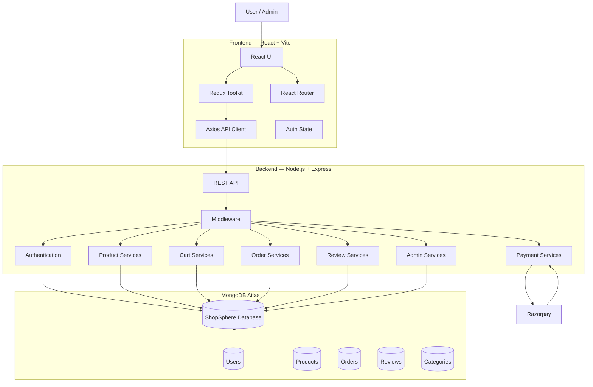
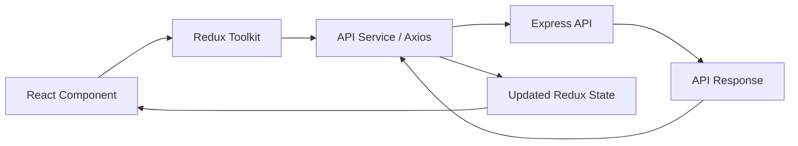
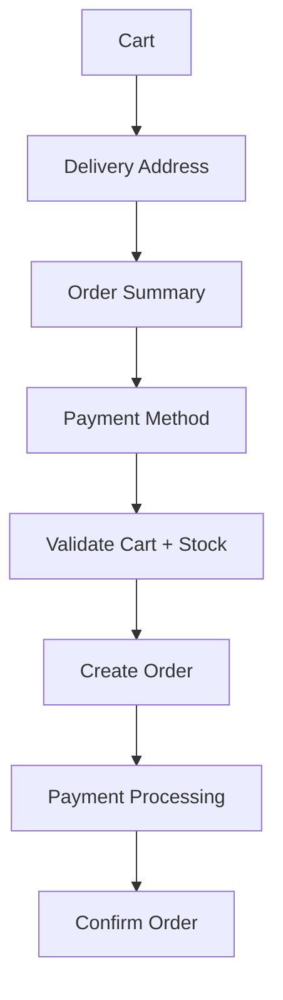
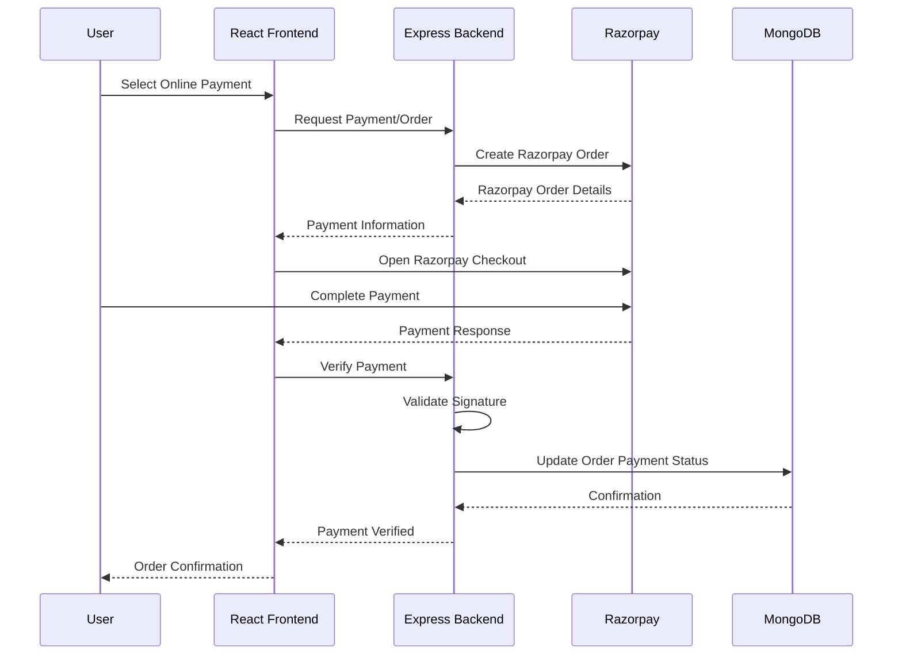
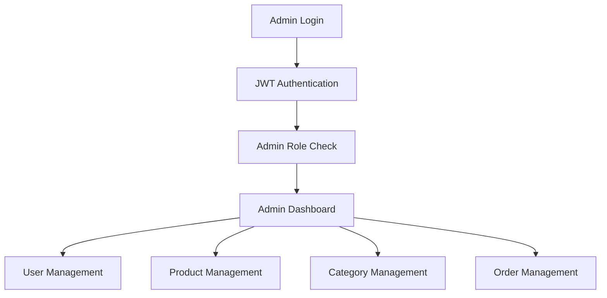
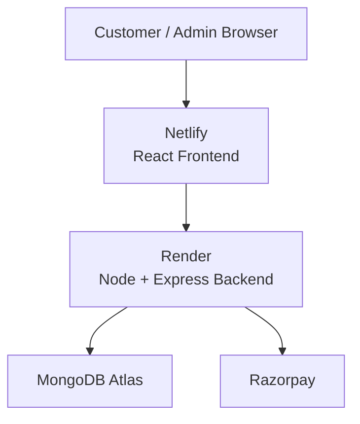
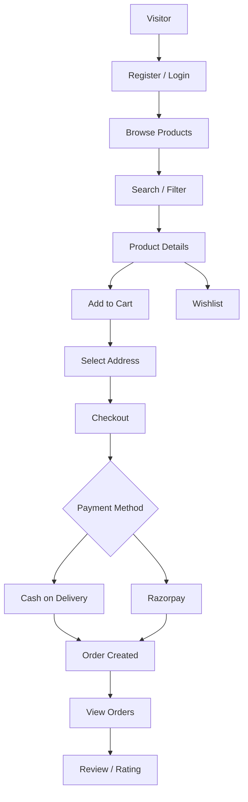

# ShopSphere — System Design

> A full-stack MERN e-commerce platform with secure authentication, product management, cart and wishlist functionality, checkout, COD and Razorpay payments, order management, reviews, search/filtering, pagination, and role-based administration.

---

## 1. System Overview

ShopSphere is a full-stack e-commerce application built using the **MERN stack**.

The system is divided into three primary layers:

1. **Frontend** — React-based client application
2. **Backend** — Node.js + Express REST API
3. **Database** — MongoDB

External services are integrated for:

* Razorpay payment processing
* MongoDB Atlas database hosting
* Cloud deployment
* Image/file serving

### High-Level Architecture



---

# 2. Technology Stack

## Frontend

| Technology      | Purpose                 |
| --------------- | ----------------------- |
| React 19        | UI development          |
| Vite            | Frontend build tool     |
| React Router    | Client-side routing     |
| Redux Toolkit   | Global state management |
| Axios           | HTTP/API communication  |
| Tailwind CSS    | Styling                 |
| React Hook Form | Form management         |
| React Hot Toast | Notifications           |
| Lucide React    | UI icons                |
| JavaScript      | Application language    |

---

## Backend

| Technology    | Purpose                    |
| ------------- | -------------------------- |
| Node.js       | JavaScript runtime         |
| Express       | REST API framework         |
| MongoDB       | Database                   |
| Mongoose      | MongoDB ODM                |
| JWT           | Authentication             |
| bcrypt        | Password hashing           |
| CORS          | Cross-origin configuration |
| Helmet        | HTTP security headers      |
| Morgan        | HTTP request logging       |
| Cookie Parser | Cookie handling            |
| dotenv        | Environment configuration  |

---

## External Services

| Service       | Purpose                   |
| ------------- | ------------------------- |
| MongoDB Atlas | Cloud database            |
| Razorpay      | Online payment processing |
| Render        | Backend deployment        |
| Netlify       | Frontend deployment       |

---

# 3. Repository Architecture

ShopSphere follows a separated frontend/backend architecture.

```text
ShopSphere/
│
├── BackEnd/
│   ├── src/
│   │   ├── controllers/
│   │   ├── middleware/
│   │   ├── models/
│   │   ├── routes/
│   │   ├── services/
│   │   ├── scripts/
│   │   ├── utils/
│   │   ├── app.js
│   │   └── server.js
│   │
│   ├── uploads/
│   ├── .env
│   ├── package.json
│   └── ...
│
├── FrontEnd/
│   ├── src/
│   │   ├── components/
│   │   ├── pages/
│   │   ├── redux/
│   │   ├── services/
│   │   ├── utils/
│   │   ├── assets/
│   │   ├── App.jsx
│   │   └── main.jsx
│   │
│   ├── public/
│   ├── .env
│   ├── package.json
│   └── ...
│
├── systemdesign.md
└── README.md
```

---

# 4. Architectural Style

ShopSphere primarily follows a:

**Client → REST API → Service/Controller → Model → MongoDB**

architecture.

```text
React Frontend
      │
      │ HTTP / HTTPS
      ▼
Express REST API
      │
      ├── Middleware
      │
      ├── Authentication
      │
      ├── Authorization
      │
      ├── Controllers
      │
      ├── Business Logic / Services
      │
      ▼
   Mongoose
      │
      ▼
 MongoDB Atlas
```

This separation allows the frontend and backend to be independently developed and deployed.

---

# 5. Frontend Architecture

The frontend is a Single Page Application built using React.

## Main Responsibilities

The frontend handles:

* User interface
* Client-side routing
* Authentication state
* Product browsing
* Search and filtering
* Cart management
* Wishlist management
* Address management
* Checkout
* Payment initiation
* Order viewing
* Reviews and ratings
* Admin dashboard
* API communication
* Loading and error states

---

## Frontend Data Flow



---

# 6. State Management

Redux Toolkit is used for application-wide state.

Typical global state areas include:

```text
Redux Store
│
├── Authentication
│   ├── user
│   ├── token/session information
│   └── authentication status
│
├── Cart
│   ├── cart items
│   ├── quantities
│   └── totals
│
├── Wishlist
│   └── wishlist products
│
├── Products
│   ├── product list
│   ├── loading
│   ├── pagination
│   └── filters
│
└── Orders
    ├── orders
    ├── order details
    └── order status
```

Local component state is used for UI-specific state where global state is unnecessary.

---

# 7. Backend Architecture

The backend is an Express REST API running on Node.js.

The backend is responsible for:

* Authentication
* Authorization
* User management
* Product management
* Category management
* Cart operations
* Wishlist operations
* Address management
* Checkout
* Orders
* Payments
* Reviews
* Admin operations
* Database communication

---

# 8. Backend Request Lifecycle

A typical request follows this flow:

```text
Client
  │
  ▼
HTTP Request
  │
  ▼
Express Router
  │
  ▼
Middleware
  │
  ├── CORS
  ├── Helmet
  ├── Authentication
  └── Authorization
  │
  ▼
Controller
  │
  ▼
Business Logic / Service
  │
  ▼
Mongoose Model
  │
  ▼
MongoDB
  │
  ▼
Response
  │
  ▼
Frontend
```

---

# 9. API Structure

The backend API is organized under:

```text
/api
```

Major API modules include:

```text
/api/auth
/api/categories
/api/products
/api/cart
/api/orders
/api/users
/api/admin
```

The exact route implementation should remain the source of truth when endpoints are changed.

---

# 10. Authentication System

ShopSphere uses token-based authentication with JWT.

## Registration

```text
User
 │
 ▼
Registration Form
 │
 ▼
POST /api/auth/register
 │
 ▼
Validate User Data
 │
 ▼
Hash Password using bcrypt
 │
 ▼
Create User
 │
 ▼
Store in MongoDB
 │
 ▼
Return Authentication Result
```

---

## Login

```text
User
 │
 ▼
Login Form
 │
 ▼
POST /api/auth/login
 │
 ▼
Find User
 │
 ▼
Compare Password
 │
 ▼
Generate JWT
 │
 ▼
Return Authentication Data
 │
 ▼
Frontend Stores Authentication State
```

---

# 11. Authentication Middleware

Protected routes require authentication.

```text
Request
   │
   ▼
Read JWT
   │
   ▼
Verify Token
   │
   ├── Invalid → 401 Unauthorized
   │
   └── Valid
        │
        ▼
     Identify User
        │
        ▼
     Continue Request
```

Authentication should never rely only on frontend route protection.

The backend remains responsible for enforcing authorization.

---

# 12. Role-Based Authorization

ShopSphere supports two primary roles:

```text
user
admin
```

## User

Regular users can:

* Register/login
* Browse products
* Search products
* Filter products
* Add products to cart
* Manage wishlist
* Manage addresses
* Checkout
* Place COD orders
* Make online payments
* View their orders
* Review/rate products

## Admin

Admins can additionally:

* Manage products
* Manage categories
* Manage users
* Manage orders
* Access administrative functionality
* Monitor platform data

---

## Authorization Flow

```text
Request
   │
   ▼
JWT Authentication
   │
   ▼
Authenticated User
   │
   ▼
Check Role
   │
   ├── user → User permissions
   │
   └── admin → Admin permissions
```

Unauthorized administrative requests should be rejected by the backend.

---

# 13. Database Architecture

MongoDB is used as the primary persistent database.

Production deployment uses **MongoDB Atlas**.

Conceptually, the database contains collections for:

```text
users
products
categories
orders
reviews
cart-related data
address-related data
```

The exact collection structure is controlled by the Mongoose models.

---

# 14. User Model

The user entity contains information such as:

```text
User
├── name
├── email
├── password
├── phone
├── avatar
├── role
└── isBlocked
```

### Important Rules

* Passwords must never be stored in plaintext.
* Passwords are hashed using bcrypt.
* Role determines authorization.
* Blocked users can be restricted from accessing protected functionality.

---

# 15. Product Model

Products contain information such as:

```text
Product
├── slug
├── category
├── price
├── discountPrice
├── stock
├── sold
├── images
└── rating
```

Product functionality includes:

* Product creation
* Product updates
* Product deletion
* Product listing
* Product details
* Category filtering
* Search
* Sorting
* Pagination
* Stock management
* Ratings

---

# 16. Category System

Categories provide product organization.

```text
Category
   │
   ├── Category information
   │
   └── Related Products
```

Categories are used by product browsing and filtering functionality.

---

# 17. Cart Architecture

The cart allows users to maintain products before checkout.

## Add to Cart

```text
User
 │
 ▼
Product Page
 │
 ▼
Select Quantity
 │
 ▼
Add to Cart
 │
 ▼
POST /api/cart
 │
 ▼
Authenticate User
 │
 ▼
Validate Product / Stock
 │
 ▼
Update Cart
 │
 ▼
MongoDB
```

---

## Cart Update

```text
Cart UI
 │
 ▼
Quantity Change
 │
 ▼
API Request
 │
 ▼
Validate Stock
 │
 ▼
Update Cart
 │
 ▼
Return Updated Cart
```

---

# 18. Wishlist Architecture

Users can save products for later.

```text
Product
  │
  ▼
Add / Remove Wishlist
  │
  ▼
Authenticated API
  │
  ▼
User Wishlist Data
  │
  ▼
MongoDB
```

The wishlist is associated with the authenticated user.

---

# 19. Address Management

Users can manage their delivery addresses.

Typical operations:

```text
Create Address
Update Address
Delete Address
Select Address
```

Address information is used during checkout and order creation.

---

# 20. Checkout Architecture

Checkout combines:

```text
Cart
+
User
+
Address
+
Products
+
Pricing
+
Payment Method
```

## Checkout Flow



---

# 21. Cash on Delivery

For COD:

```text
Checkout
   │
   ▼
Select COD
   │
   ▼
Validate Cart
   │
   ▼
Create Order
   │
   ▼
Set Payment Method = COD
   │
   ▼
Order Confirmation
```

No external payment gateway is required for COD.

---

# 22. Razorpay Payment Architecture

Razorpay is used for online payment processing.

The frontend should not be trusted to determine payment success.

## Payment Flow



---

# 23. Payment Security

Payment verification must happen on the backend.

Important principles:

* Never trust a frontend-only payment success response.
* Razorpay credentials must remain server-side.
* Secret keys must never be committed to Git.
* Payment signatures should be verified on the backend.
* Environment variables should be used for payment credentials.

Example environment configuration:

```env
RAZORPAY_KEY_ID=...
RAZORPAY_KEY_SECRET=...
```

The actual credentials must never be stored in this documentation.

---

# 24. Order Management

Orders represent completed checkout transactions.

An order conceptually contains:

```text
Order
├── User
├── Products
├── Delivery Address
├── Pricing
├── Payment Method
├── Payment Status
├── Order Status
└── Timestamps
```

---

# 25. Order Lifecycle

A typical order can move through states such as:

```text
Created
   │
   ▼
Confirmed
   │
   ▼
Processing
   │
   ▼
Shipped
   │
   ▼
Delivered
```

Cancellation/refund-related transitions should be handled according to the application's implemented business rules.

---

# 26. User Order Flow

```text
User
 │
 ▼
Checkout
 │
 ▼
Create Order
 │
 ▼
Payment / COD
 │
 ▼
Order Stored
 │
 ▼
My Orders
 │
 ▼
Order Details
```

Users should only be able to access their own order information.

---

# 27. Admin Order Flow

```text
Admin Dashboard
       │
       ▼
View Orders
       │
       ▼
Select Order
       │
       ▼
Update Order Status
       │
       ▼
Persist Changes
       │
       ▼
User Sees Updated Status
```

Backend authorization prevents normal users from accessing admin-only operations.

---

# 28. Reviews and Ratings

Authenticated users can submit product reviews and ratings.

```text
User
 │
 ▼
Purchased / Eligible Product
 │
 ▼
Submit Review
 │
 ▼
Backend Validation
 │
 ▼
Store Review
 │
 ▼
Update Product Rating
 │
 ▼
Display Rating
```

Reviews contribute to product rating information.

---

# 29. Product Search

ShopSphere supports product search.

Conceptually:

```text
Search Query
     │
     ▼
Frontend
     │
     ▼
Products API
     │
     ▼
MongoDB Query
     │
     ▼
Matching Products
     │
     ▼
Frontend Results
```

Search should be handled server-side for scalability rather than loading every product into the browser.

---

# 30. Filtering and Sorting

Products can be filtered/sorted using supported criteria such as:

* Category
* Price
* Rating
* Search query
* Other implemented product attributes

Conceptual request:

```text
/products
    ?search=...
    &category=...
    &sort=...
    &page=...
    &limit=...
```

The exact query parameters should follow the current backend implementation.

---

# 31. Pagination

Pagination prevents the frontend from loading the entire product dataset at once.

```text
Database
   │
   ▼
Page 1 → Products 1–N
Page 2 → Products N+1–2N
Page 3 → Products 2N+1–3N
```

This improves:

* Initial response size
* Frontend rendering
* Network usage
* Scalability

---

# 32. Admin Architecture

The admin module is protected using authentication + role authorization.



---

# 33. Admin Product Management

Admin functionality includes product CRUD operations.

```text
Create Product
       │
       ▼
Validate Data
       │
       ▼
Store Product
       │
       ▼
MongoDB
```

Similarly:

```text
Read → Update → Delete
```

are protected admin operations.

---

# 34. Security Architecture

ShopSphere applies multiple security layers.

## Password Security

Passwords are hashed using:

```text
bcrypt
```

Plaintext passwords should never be stored.

---

## JWT Authentication

JWT is used to identify authenticated users.

Protected APIs validate authentication before executing user-specific operations.

---

## HTTP Security Headers

Helmet is used to improve HTTP security.

```javascript
helmet()
```

---

## CORS

CORS restricts which frontend origins can communicate with the backend.

Production configuration should allow the deployed frontend origin rather than an unrestricted wildcard.

---

## Environment Variables

Sensitive configuration belongs in environment variables.

Examples:

```env
DATABASE_URL=...
JWT_SECRET=...
RAZORPAY_KEY_ID=...
RAZORPAY_KEY_SECRET=...
```

`.env` files should not be committed to Git.

---

# 35. Image Handling

Product and user images are handled through the backend/static upload mechanism used by the application.

The frontend uses an image URL utility to correctly construct image URLs.

Conceptually:

```text
Stored Image Path
       │
       ▼
Backend Base URL
       │
       ▼
Complete Image URL
       │
       ▼
React 
```

The application also provides a fallback placeholder when an image is unavailable.

---

# 36. Error Handling

Errors should follow a predictable request/response lifecycle.

```text
Request
  │
  ▼
Validation
  │
  ├── Invalid → 400
  │
  ▼
Authentication
  │
  ├── Missing/Invalid → 401
  │
  ▼
Authorization
  │
  ├── Forbidden → 403
  │
  ▼
Resource
  │
  ├── Not Found → 404
  │
  ▼
Server Error
  │
  └── 500
```

Frontend API services should convert backend errors into user-friendly messages.

---

# 37. HTTP Status Code Strategy

ShopSphere should follow standard HTTP semantics.

| Status | Meaning                        |
| ------ | ------------------------------ |
| 200    | Successful request             |
| 201    | Resource created               |
| 400    | Invalid request                |
| 401    | Authentication required/failed |
| 403    | Access forbidden               |
| 404    | Resource not found             |
| 409    | Conflict                       |
| 500    | Internal server error          |

---

# 38. Deployment Architecture

The production system separates frontend and backend deployment.



---

# 39. Production Environment

## Frontend

The React application is deployed separately from the API.

The frontend uses an environment variable for the backend API URL.

Example:

```env
VITE_API_URL=https://your-backend-url/api
```

The production value must point to the deployed backend.

---

## Backend

The backend is deployed on Render.

Typical production configuration includes:

```env
PORT=5000
DATABASE_URL=...
JWT_SECRET=...
RAZORPAY_KEY_ID=...
RAZORPAY_KEY_SECRET=...
CLIENT_URL=...
```

Actual environment variable names should match the current backend implementation.

---

# 40. Database Deployment

Production database:

```text
MongoDB Atlas
```

Connection flow:

```text
Render Backend
      │
      │ DATABASE_URL
      ▼
MongoDB Atlas
      │
      ▼
ShopSphere Database
```

The production database should not use the local development URL:

```text
mongodb://127.0.0.1:27017/shopsphere
```

The production backend must use the MongoDB Atlas connection string.

---

# 41. Development vs Production

## Development

```text
React/Vite
   │
   ▼
localhost frontend
   │
   ▼
localhost backend
   │
   ▼
Local MongoDB / development database
```

## Production

```text
Netlify
   │
   ▼
Render
   │
   ▼
MongoDB Atlas
```

---

# 42. Configuration Separation

Development and production configuration should remain separate.

```text
Development
    ↓
.env.local / local configuration

Production
    ↓
Deployment platform environment variables
```

Secrets should never be hardcoded inside source files.

---

# 43. Scalability Considerations

The current architecture is suitable for a small-to-medium e-commerce application.

Potential future improvements include:

### Database Indexing

Add indexes for frequently queried fields such as:

```text
email
slug
category
search fields
createdAt
order user references
```

---

### Caching

Redis can be introduced for:

```text
Popular products
Categories
Frequently accessed data
Session-related caching
```

---

### Image Storage

For larger production workloads, move image storage from local/server storage to cloud object storage such as:

```text
AWS S3
Cloudinary
Cloudflare R2
```

---

### CDN

Static assets and product images can be served through a CDN.

```text
User
 │
 ▼
CDN
 │
 ▼
Images / Static Assets
```

This reduces backend load and improves global performance.

---

# 44. Performance Strategy

Current architecture already benefits from:

* Vite production builds
* Client-side routing
* Redux state management
* Server-side pagination
* Server-side filtering
* API-based product loading

Future optimizations:

```text
Database Indexes
       +
Caching
       +
CDN
       +
Lazy Loading
       +
Image Optimization
```

---

# 45. Reliability

The system should handle failures at each layer.

```text
Frontend Failure
      ↓
Display User-Friendly Error

API Failure
      ↓
HTTP Error Response

Database Failure
      ↓
Backend Error Handling

Payment Failure
      ↓
Payment Status Remains Unconfirmed

Network Failure
      ↓
Retry / Error State
```

Payment and order operations should avoid creating inconsistent order states.

---

# 46. Important Business Invariants

The following rules are important to maintain system correctness.

### Authentication

A user must be authenticated before accessing protected user resources.

### Authorization

A normal user must not be able to perform admin operations.

### Cart

Product quantity must not exceed available stock.

### Orders

Users must only access their own orders.

### Payments

Payment success must be verified server-side.

### Passwords

Passwords must never be stored as plaintext.

### Secrets

API keys and database credentials must never be committed to Git.

### Stock

Order creation must validate product availability.

---

# 47. Complete Customer Journey



---

# 48. Complete Admin Journey

```text
Admin Login
     │
     ▼
JWT Authentication
     │
     ▼
Admin Authorization
     │
     ▼
Admin Dashboard
     │
     ├── Users
     │
     ├── Products
     │
     ├── Categories
     │
     └── Orders
```

---

# 49. API Security Boundary

The browser is considered an untrusted client.

```text
             TRUST BOUNDARY
────────────────────────────────────

Browser
   │
   │ Untrusted input
   ▼
Backend
   │
   ├── Validate
   ├── Authenticate
   ├── Authorize
   ├── Sanitize
   └── Process
   │
   ▼
Database
```

Frontend validation improves user experience but must never replace backend validation.

---

# 50. Data Ownership

ShopSphere follows user-based data ownership.

```text
User A
 ├── Cart A
 ├── Wishlist A
 ├── Addresses A
 └── Orders A

User B
 ├── Cart B
 ├── Wishlist B
 ├── Addresses B
 └── Orders B
```

The backend uses the authenticated user's identity to determine which resources can be accessed.

---

# 51. Observability

The backend uses request logging through Morgan.

Recommended production improvements:

```text
Application Logs
       +
Error Tracking
       +
Performance Monitoring
       +
Database Monitoring
```

Possible future tools:

* Sentry
* Better structured logging
* Render monitoring
* MongoDB Atlas monitoring

---

# 52. Testing Strategy

ShopSphere should be tested at multiple levels.

## Frontend

Test:

* Login/register
* Product browsing
* Search
* Filters
* Cart
* Wishlist
* Checkout
* Orders
* Reviews
* Admin UI

## Backend

Test:

* Authentication
* Authorization
* CRUD APIs
* Cart APIs
* Order APIs
* Payment APIs
* Review APIs
* Admin APIs

## Integration

Test complete workflows:

```text
Login
 → Product
 → Cart
 → Checkout
 → Payment
 → Order
```

---

# 53. Production QA Checklist

Before final production release:

```text
[ ] Frontend production build succeeds
[ ] Backend starts successfully
[ ] MongoDB Atlas connection works
[ ] Authentication works
[ ] JWT protected routes work
[ ] Admin authorization works
[ ] Products load
[ ] Search works
[ ] Filtering works
[ ] Pagination works
[ ] Cart works
[ ] Wishlist works
[ ] Address management works
[ ] COD checkout works
[ ] Razorpay payment works
[ ] Payment verification works
[ ] Orders are created correctly
[ ] Order details work
[ ] Reviews work
[ ] Admin product management works
[ ] Admin order management works
[ ] Admin user management works
[ ] Production CORS works
[ ] Image URLs work
[ ] Environment variables are configured
[ ] No secrets are committed
[ ] No localhost API URL remains in production frontend
[ ] No production database uses localhost MongoDB
[ ] Render deployment is healthy
[ ] Netlify deployment is healthy
```

---

# 54. Failure Scenarios

## Database Unavailable

```text
API Request
    ↓
Database Connection Failure
    ↓
Backend Error Handler
    ↓
500 Response
    ↓
Frontend Error Message
```

---

## Invalid JWT

```text
Request
   ↓
JWT Verification
   ↓
Invalid
   ↓
401 Unauthorized
```

---

## Unauthorized Admin Request

```text
Authenticated User
       ↓
Role Check
       ↓
role !== admin
       ↓
403 Forbidden
```

---

## Razorpay Failure

```text
Checkout
   ↓
Razorpay
   ↓
Payment Failed
   ↓
Do Not Treat As Successful Payment
   ↓
Show Payment Failure
```

---

# 55. Current System Characteristics

ShopSphere is designed as a **modular monolithic backend with a separate React frontend**.

This is intentionally simpler than a microservices architecture.

```text
                    ShopSphere
                        │
          ┌─────────────┴─────────────┐
          │                           │
      Frontend                    Backend
       React                    Express API
                                      │
                    ┌─────────────────┼─────────────────┐
                    │                 │                 │
                 Auth              Commerce          Admin
                    │                 │                 │
                    └─────────────────┼─────────────────┘
                                      │
                                  MongoDB
```

For the current project size, this architecture provides a good balance between:

* Development speed
* Maintainability
* Deployment simplicity
* Feature separation
* Cost
* Scalability

---

# 56. Future Architecture

If ShopSphere grows significantly, individual backend modules can be separated into services.

Possible future architecture:

```text
                    API Gateway
                         │
       ┌─────────────────┼──────────────────┐
       │                 │                  │
 Auth Service       Product Service     Order Service
       │                 │                  │
       └─────────────────┼──────────────────┘
                         │
                  Payment Service
                         │
                      Razorpay
```

Additional infrastructure could include:

```text
Redis
Message Queue
Object Storage
CDN
Search Engine
Monitoring
```

However, introducing microservices prematurely would increase operational complexity.

---

# 57. Design Principles

ShopSphere follows these core design principles:

### Separation of Concerns

Frontend, API, business logic, and database responsibilities remain separated.

### Security by Backend Enforcement

Frontend controls are not considered sufficient for security.

### Stateless API

JWT-based authentication allows backend instances to remain independently scalable.

### Modular Backend

Authentication, products, cart, orders, payments, reviews, and admin functionality are separated into logical modules.

### API-First Communication

The React application communicates with backend functionality through REST APIs.

### Environment-Based Configuration

Environment-specific settings and secrets are externalized.

### Production Awareness

Development URLs, credentials, and local database configuration must not leak into production.

---

# 58. Architecture Summary

```text
┌──────────────────────────────────────────────────────────┐
│                      SHOPSPHERE                          │
└──────────────────────────────────────────────────────────┘

                         USERS
                           │
                           ▼
                ┌──────────────────┐
                │ React Frontend   │
                │ React + Vite     │
                │ Redux Toolkit    │
                │ Tailwind         │
                └────────┬─────────┘
                         │ HTTPS
                         ▼
                ┌──────────────────┐
                │ Express REST API │
                │ Node.js          │
                └────────┬─────────┘
                         │
             ┌───────────┼────────────┐
             │           │            │
             ▼           ▼            ▼
          Auth       Commerce       Admin
             │           │            │
             │      ┌────┼────┐       │
             │      │    │    │       │
             │    Cart Orders Payment  │
             │      │    │    │       │
             │      └────┼────┘       │
             │           │            │
             └───────────┼────────────┘
                         │
                         ▼
                ┌──────────────────┐
                │    Mongoose      │
                └────────┬─────────┘
                         │
                         ▼
                ┌──────────────────┐
                │  MongoDB Atlas   │
                └──────────────────┘
                         
                         │
                  Payment Integration
                         │
                         ▼
                   ┌───────────┐
                   │ Razorpay  │
                   └───────────┘
```

---

# 59. Final Architecture Statement

ShopSphere uses a **three-tier MERN architecture** with a React frontend, Node.js/Express REST backend, and MongoDB Atlas persistence layer.

The platform implements:

* JWT-based authentication
* Role-based authorization
* Product and category management
* Search, filtering and pagination
* Cart management
* Wishlist management
* Address management
* Checkout
* Cash on Delivery
* Razorpay online payments
* Order management
* Product reviews and ratings
* Administrative management

The system is designed to be **secure, modular, maintainable, deployable, and extensible**, while remaining appropriately simple for the current scale of the application.

Production deployment separates the frontend and backend:

```text
Netlify
   │
   ▼
React Frontend
   │
   ▼
Render
   │
   ▼
Node/Express Backend
   │
   ├──────────────► Razorpay
   │
   ▼
MongoDB Atlas
```

This architecture provides a strong foundation for extending ShopSphere with additional capabilities such as cloud image storage, Redis caching, CDN delivery, notifications, analytics, recommendation systems, and eventually independently scalable services.
